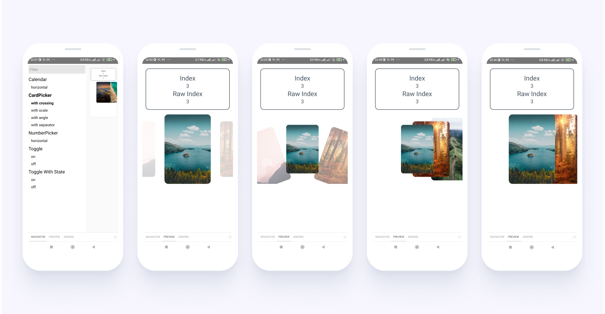

# React Native UI kit

[](https://github.com/breeffy/react-native-calendar/blob/main/LICENSE) [](https://www.npmjs.com/package/@gorhom/bottom-sheet)

## Components

| Name          |                                Package                                 | Description                                                             |
| ------------- | :--------------------------------------------------------------------: | ----------------------------------------------------------------------- |
| **Calendars** | [@breeffy/calendars](https://www.npmjs.com/package/@breeffy/calendars) | Performant calendars with gestures and animations                       |
| **Pickers**   |   [@breeffy/pickers](https://www.npmjs.com/package/@breeffy/pickers)   | Wheel pickers, swipers, carousels                                       |
| **Icons**     |     [@breeffy/icons](https://www.npmjs.com/package/@breeffy/icons)     | **Icon** component to show [FontAwesome](https://fontawesome.com) icons |
| **Elements**  |  [@breeffy/elements](https://www.npmjs.com/package/@breeffy/elements)  | **Toggle** and other essential components                               |

## Storybook

You can play with components and it's properties using **interactive storybook** playground.

Run metro server in **dev** mode and run application

```bash
yarn dev:android
```

Don't forget to install dependencies before that

```bash
yarn install
```

Code for **examples** can be found [here](https://github.com/breeffy/react-native-monorepo/tree/main/packages/example-app/src/stories).

## Showcase

### Pickers



### Calendars


## Support

### React Native Versions

Versions [`0.65.1`](https://github.com/breeffy/react-native-monorepo/tree/main/packages/mobile-0.65.1), [`0.66.0`](https://github.com/breeffy/react-native-monorepo/tree/main/packages/mobile-0.66.0), [`0.66.1`](https://github.com/breeffy/react-native-monorepo/tree/main/packages/mobile-0.66.1) are supported. For every supported version you can find example application.

Run specific example application with RN `<version>` using command

```bash
yarn dev:android:<version>
```

For example for RN `0.66.1` it will be

```bash
yarn dev:android:0.66.1
```

> RN versions `0.63.4 - 0.65.0` might work, but components are not tested against these versions.

### Peer Dependencies

Packages **allow any version** of peer dependency and it's combinations

```json
"peerDependencies": {
  "react": "*",
  "react-native": "*",
  "react-native-gesture-handler": "*",
  "react-native-reanimated": "*",
  "react-native-svg": "*"
}
```

They might have **incompatibilities between each other**.

Versions that are **guaranteed to be working** are specified in example applications.

> Select a **release commit** with version you are interested in, look at `package.json` of example application with required RN `version`

For latest packages in GitHub:
[`0.65.1`](https://github.com/breeffy/react-native-monorepo/blob/main/packages/mobile-0.65.1/package.json#L24),
[`0.66.0`](https://github.com/breeffy/react-native-monorepo/blob/main/packages/mobile-0.66.0/package.json#L24),
[`0.66.1`](https://github.com/breeffy/react-native-monorepo/blob/main/packages/mobile-0.66.1/package.json#L24).

> Other `peerDependencies` combinations **are not officially supported**, but should work.

### Operating Systems

Right now **only Android is officially supported**.

### Expo

Expo platform **is not officially supported**.

Meanwhile it's expected that **components should be working** in Expo platform since no native or platform-specific code is used.

But **storybook** playground **doesn't work with Expo** and components can't be easily tested against it.

Copyright © 2020-2022, [Victor Malov](https://github.com/likern).
